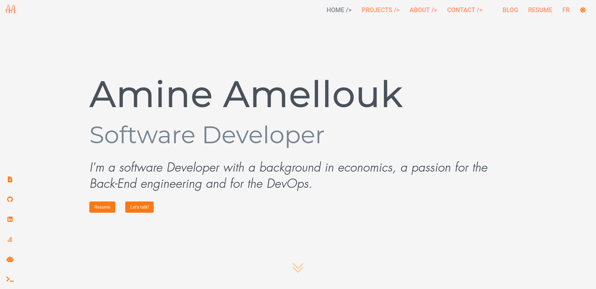

<h1 align="center">
  <br>
  Portfolio
  <br>
</h1>

<h4 align="center"><a href="https://www.amineamellouk.com" target="_blank">amineamellouk.com</a></h4>

<p align="center">
  <a href="#key-features">Key Features</a> •
  <a href="#how-to-use">How To Use</a> •
  <a href="#built-with">Built With</a> •
  <a href="#credits">Credits</a> •
  <a href="#license">License</a>
</p>


There's also light theme

<p>
I developed my portfolio as a way of learning Angular with the idea that it should be a project within my portfolio itself, thus I've implemented interesting features and also an ester egg

English version: <a href="https://www.amineamellouk.com/en" target="_blank">amineamellouk.com/en</a>

French version: <a href="https://www.amineamellouk.com/fr" target="_blank">amineamellouk.com/fr</a>
</p>

## Key Features
* Console interface
* Bot chat
* Form validation
* Routing
* Light/dark theme
* English/French languages
* JSON files as database
* Global error handling
* PDFs
* Netlify forms
* Netlify submit sitemap plugin
* Netlify script injection
* PWA

## How To Use

### Developing

To clone and run this application, you'll need [Git](https://www.git-scm.com), [Node.js](https://www.nodejs.org/en/download) (which comes with [npm](https://www.npmjs.com)) and [Angular CLI](https://cli.angular.io)

```bash
# Clone this repository
$ git clone https://github.com/AmineAML/Portfolio.git

# Go into the repository
$ cd Portfolio

# Install dependencies
npm install

# Run the site app
ng serve site
```

### Configuration

Many modifications can be applied here and there through the code, but here important files that required to configure:
* `sitemap.xml`: you can use online generators, but for SPAs (Single Page Applications) you do most of the work as most of them can't generate sitemap file with all routes (if you found one let me know)
* `_redirects`: modify the domains with your own
* `_headers`: modify all of these to your liking
* `/src/assets/data`: change to your own information, this app was built to handle two languages but you can easily use only english or if you would like add more
* `/src/app/i18n`: this includes each text with its equivalant in the other language

### Deploying

This project can be adjusted for different deployment options, but it's designed to deploy to [Netlify](https://www.netlify.com)

## Built With

- [Angular](https://angular.io/)
- [Angular Material](https://material.angular.io/)
- [Flex-Layout](https://github.com/angular/flex-layout)
- [Animate On Scroll](https://github.com/michalsnik/aos)
- [DialogFlow](https://cloud.google.com/dialogflow)
- [Google Tag Manager](https://developers.google.com/tag-manager)
- [Font Awesome](https://fontawesome.com/)
- [Scully](https://github.com/scullyio/scully)

## Credits

- [Lottiefiles](https://lottiefiles.com/)
- [Remove bg](https://www.remove.bg/)
- Bunch Blossoms font
- Futura LT W01 Light Oblique font
- CV inspired jsonresume.org

Extensions:
- [Keyframes](https://keyframes.app/)
- [ColorZilla](https://www.colorzilla.com/chrome/)
- [Wappalyzer](https://www.wappalyzer.com/)
- [Checkbot](https://www.checkbot.io/)

## License
This project is licensed under [MIT](https://github.com/AmineAML/Portfolio/blob/main/LICENSE)